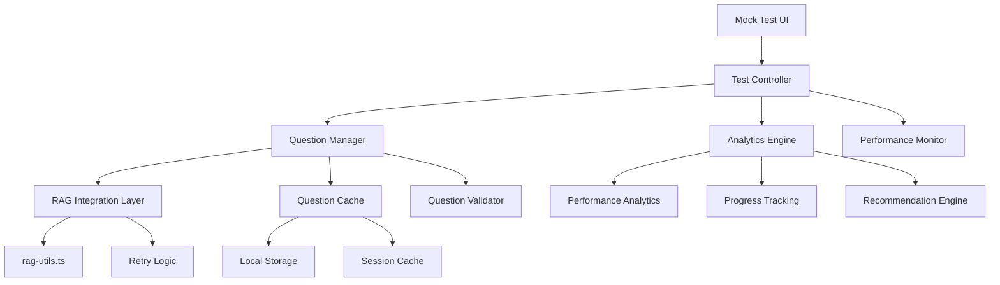

# Design Document

## Overview

This design enhances the existing mock test system by improving the RAG integration, adding comprehensive analytics, implementing performance optimizations, and creating a more robust user experience. The design builds upon the current architecture while adding new components for caching, analytics, and enhanced question management.

## Architecture

### Current Architecture Analysis
The existing system has:
- React-based UI with state management for test flow
- Direct integration with `rag-utils.ts` for question generation
- Basic error handling and fallback mechanisms
- Simple result calculation and display

### Enhanced Architecture Components



## Components and Interfaces

### 1. Enhanced Question Manager

**Purpose:** Manages question generation, caching, and validation with improved reliability.

**Key Features:**
- Question deduplication within sessions
- Quality validation before serving questions
- Intelligent caching with expiration
- Retry mechanisms with different parameters

**Interface:**
```typescript
interface EnhancedQuestionManager {
  generateQuestions(params: TestConfig): Promise<Question[]>;
  validateQuestions(questions: Question[]): ValidationResult;
  getCachedQuestions(cacheKey: string): Question[] | null;
  preloadQuestions(configs: TestConfig[]): Promise<void>;
}

interface ValidationResult {
  valid: Question[];
  invalid: Question[];
  issues: ValidationIssue[];
}
```

### 2. Analytics Engine

**Purpose:** Provides comprehensive performance analytics and learning insights.

**Key Features:**
- Topic-wise performance breakdown
- Year-wise question analysis
- Difficulty-based performance tracking
- Time analysis per question
- Progress tracking across multiple tests

**Interface:**
```typescript
interface AnalyticsEngine {
  calculateDetailedResults(test: CompletedTest): DetailedResults;
  getProgressHistory(userId?: string): ProgressHistory;
  generateRecommendations(performance: DetailedResults): Recommendation[];
  getTopicAnalysis(results: DetailedResults): TopicAnalysis;
}

interface DetailedResults extends TestResult {
  topicBreakdown: TopicPerformance[];
  yearAnalysis: YearPerformance[];
  difficultyAnalysis: DifficultyPerformance[];
  timeAnalysis: TimeAnalysis;
  conceptualGaps: ConceptGap[];
}
```

### 3. Performance Monitor

**Purpose:** Monitors system performance and implements optimizations.

**Key Features:**
- Question loading time tracking
- Error rate monitoring
- Cache hit rate optimization
- Network connectivity detection

**Interface:**
```typescript
interface PerformanceMonitor {
  trackQuestionLoadTime(startTime: number, questionCount: number): void;
  monitorErrorRate(operation: string, success: boolean): void;
  getCacheMetrics(): CacheMetrics;
  checkConnectivity(): Promise<boolean>;
}
```

### 4. Enhanced Test Configuration

**Purpose:** Provides advanced test customization options.

**Interface:**
```typescript
interface EnhancedTestConfig extends TestConfig {
  topicSelection?: string[];
  difficultyDistribution?: DifficultyDistribution;
  yearRange?: YearRange;
  questionTypes?: QuestionType[];
  customSettings?: CustomTestSettings;
}

interface DifficultyDistribution {
  easy: number;    // percentage
  medium: number;  // percentage
  hard: number;    // percentage
}

interface YearRange {
  startYear: number;
  endYear: number;
}
```

## Data Models

### Enhanced Question Model
```typescript
interface EnhancedQuestion extends Question {
  metadata: QuestionMetadata;
  qualityScore: number;
  sourceConfidence: number;
  relatedConcepts: string[];
  visualAids?: VisualAid[];
}

interface QuestionMetadata {
  generatedAt: Date;
  sourceType: 'groq' | 'fallback' | 'cached';
  validationStatus: 'validated' | 'pending' | 'failed';
  cacheKey: string;
  retryCount: number;
}

interface VisualAid {
  type: 'formula' | 'diagram' | 'image' | 'chart';
  content: string;
  description: string;
}
```

### Analytics Data Models
```typescript
interface TopicPerformance {
  topic: string;
  subtopics: SubtopicPerformance[];
  overallAccuracy: number;
  averageTime: number;
  difficultyBreakdown: Record<string, number>;
}

interface YearPerformance {
  year: number;
  questionsAttempted: number;
  accuracy: number;
  averageTime: number;
  topicDistribution: Record<string, number>;
}

interface TimeAnalysis {
  averageTimePerQuestion: number;
  fastestQuestion: { id: string; time: number };
  slowestQuestion: { id: string; time: number };
  timeDistribution: TimeDistribution[];
}

interface ConceptGap {
  concept: string;
  weaknessLevel: 'mild' | 'moderate' | 'severe';
  relatedQuestions: string[];
  recommendedResources: string[];
}
```

### Caching Strategy
```typescript
interface QuestionCache {
  sessionCache: Map<string, CachedQuestionSet>;
  persistentCache: Map<string, CachedQuestionSet>;
  cacheMetrics: CacheMetrics;
}

interface CachedQuestionSet {
  questions: Question[];
  createdAt: Date;
  expiresAt: Date;
  hitCount: number;
  config: TestConfig;
}
```

## Error Handling

### Enhanced Error Recovery
1. **Question Generation Failures:**
   - Retry with modified parameters (different difficulty, reduced count)
   - Fallback to cached questions from similar configurations
   - Progressive degradation to sample questions with clear user notification

2. **Network Issues:**
   - Detect connectivity status
   - Use cached questions when offline
   - Queue question generation requests for when connectivity returns

3. **Validation Failures:**
   - Filter out invalid questions automatically
   - Log validation issues for system improvement
   - Supplement with additional questions to meet required count

### Error Reporting
```typescript
interface ErrorReport {
  timestamp: Date;
  operation: string;
  errorType: string;
  errorMessage: string;
  context: Record<string, any>;
  recoveryAction: string;
  userImpact: 'none' | 'minor' | 'major';
}
```

## Testing Strategy

### Unit Testing
- Question validation logic
- Analytics calculation functions
- Caching mechanisms
- Error handling scenarios

### Integration Testing
- RAG system integration with retry logic
- Cache persistence and retrieval
- Analytics data flow
- Performance monitoring accuracy

### User Experience Testing
- Test flow with various network conditions
- Question loading performance
- Analytics display accuracy
- Error message clarity

### Performance Testing
- Question generation speed under load
- Cache efficiency with large datasets
- Memory usage with extended test sessions
- UI responsiveness during heavy operations

## Implementation Phases

### Phase 1: Core Enhancements
- Enhanced question manager with validation
- Basic caching implementation
- Improved error handling and retry logic

### Phase 2: Analytics Engine
- Detailed performance analytics
- Topic and year-based analysis
- Time tracking and analysis

### Phase 3: Advanced Features
- Custom test configuration
- Recommendation engine
- Progress tracking across sessions

### Phase 4: Performance Optimization
- Advanced caching strategies
- Performance monitoring
- Offline capability

## Security Considerations

- Validate all user inputs for test configuration
- Sanitize question content before display
- Implement rate limiting for question generation
- Secure storage of user progress data
- Privacy protection for analytics data

## Scalability Considerations

- Efficient caching to reduce API calls
- Lazy loading of analytics data
- Pagination for large result sets
- Optimized data structures for fast lookups
- Memory management for long test sessions